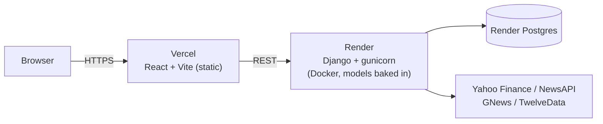

# Smart Stock Predictor

**A production-deployed time-series forecasting platform** — Django + DRF backend serving LSTM/Transformer price predictions, a React terminal-style dashboard, containerized with Docker, and shipped through a GitHub Actions CI/CD pipeline to Render (API) and Vercel (frontend).

[](https://github.com/aditya-ag26/Smart-Stock-Prediction/actions/workflows/ci.yml)
[](https://github.com/aditya-ag26/Smart-Stock-Prediction/actions/workflows/codeql.yml)


---

## What this is

Smart Stock Predictor is a terminal-style market analytics and forecasting platform for Indian equities and indices. It combines a Django backend (market data, technical indicators, sentiment, LSTM/Transformer model serving) with a React + Vite frontend rendering a high-density trading terminal.

This repo is also **Phase 1 of a three-part productionization track**: taking a working ML prototype and shipping it as a real, deployed system — containerized, tested in CI, security-hardened, and deployed through an auditable pipeline — rather than something that only runs on `localhost`. See [`docs/ARCHITECTURE.md`](docs/ARCHITECTURE.md) for the full system design and the reasoning behind each production decision.

## Architecture at a glance



Full diagram, request flow, and the "why" behind each decision: [`docs/ARCHITECTURE.md`](docs/ARCHITECTURE.md).

## Key capabilities

- Terminal-style market workstation UI with price/volume charts, market breadth, and sector analytics
- Technical indicators (RSI, MACD, ATR) and volatility/returns analytics
- Daily sentiment timeline from NewsAPI + GNews, scored with TextBlob
- Prediction endpoints for both LSTM and Transformer models, plus a side-by-side model comparison endpoint
- Asset-aware model routing (per-symbol models where available, falling back to global models)

## Getting started

### Option A — Docker Compose (recommended, closest to production)

```bash
cp backend/stockproject/.env.example backend/stockproject/.env
docker compose up --build
```

| Service | URL |
|---|---|
| Frontend | http://localhost:5173 |
| Backend API | http://localhost:8000 |

Full walkthrough, including Render/Vercel deployment: [`docs/DEPLOYMENT.md`](docs/DEPLOYMENT.md).

### Option B — Manual (venv + npm)

```bash
# Backend
cd backend/stockproject
python -m venv .venv && .venv\Scripts\Activate.ps1   # Windows PowerShell
pip install -r predictor/requirements.txt
python manage.py migrate
python manage.py runserver                             # http://127.0.0.1:8000

# Frontend (separate terminal)
cd frontend
npm install
npm run dev                                             # http://127.0.0.1:5173
```

If you see `no such table: predictor_tickermetadata`, run `python manage.py makemigrations && python manage.py migrate`.

Optional data backfill: `python manage.py sync_market_data --years 5` (implementation: [`sync_market_data.py`](backend/stockproject/predictor/management/commands/sync_market_data.py)).

## Environment variables

See [`backend/stockproject/.env.example`](backend/stockproject/.env.example) and [`frontend/.env.example`](frontend/.env.example) for the full list. Key ones:

| Variable | Where | Purpose |
|---|---|---|
| `SECRET_KEY` | backend | Django secret key; falls back to a dev-only default if unset |
| `DEBUG` | backend | `True` locally, `False` in production |
| `ALLOWED_HOSTS` | backend | Comma-separated host allowlist |
| `CORS_ALLOWED_ORIGINS` | backend | Frontend origin(s) allowed to call the API in production |
| `DATABASE_URL` | backend | If set, switches from SQLite to Postgres automatically |
| `NEWS_API_KEY`, `GNEWS_API_KEY` | backend | Sentiment ingestion (optional — degrades gracefully if unset) |
| `TWELVEDATA_API_KEY` | backend | Fallback market data source (optional) |
| `VITE_API_BASE_URL` | frontend | Backend URL baked in at build time |

## API overview

Full route list: [`stockapi/urls.py`](backend/stockproject/stockapi/urls.py) (`/api/`) and [`predictor/urls.py`](backend/stockproject/predictor/urls.py) (`/predict/`).

```
GET /api/health/
GET /api/stocks/
GET /api/market-overview/
GET /api/price-history/?symbol=RELIANCE.NS&days=365
GET /api/technical-indicators/?symbol=RELIANCE.NS
GET /api/sentiment/?symbol=RELIANCE.NS&days=180
GET /api/prediction/?symbol=RELIANCE.NS&horizon_days=1
GET /api/advanced-analytics/?symbol=RELIANCE.NS&days=365
GET /api/model_comparison/?symbol=RELIANCE.NS

GET /predict/health/
GET /predict/stocks/
GET /predict/model-comparison/?symbol=RELIANCE.NS
GET /predict/RELIANCE.NS/?model=lstm
GET /predict/RELIANCE.NS/?model=transformer
```

## Testing & CI/CD

```bash
# Backend
cd backend/stockproject && python manage.py test stockapi

# Frontend
cd frontend && npm test
```

Every push to `main` runs [`.github/workflows/ci.yml`](.github/workflows/ci.yml): backend tests → frontend tests → Docker build + Trivy image scan → gated deploys to Render (backend) and Vercel (frontend). [`codeql.yml`](.github/workflows/codeql.yml) and [`gitleaks.yml`](.github/workflows/gitleaks.yml) run static analysis and secret-leak scanning on every push/PR. [`dependabot.yml`](.github/dependabot.yml) keeps `pip`/`npm`/Action dependencies current.

## Security

- No hardcoded secrets: API keys are env-only ([`news_sentiment.py`](backend/stockproject/predictor/news_sentiment.py)); see [`docs/DEPLOYMENT.md#api-key-rotation`](docs/DEPLOYMENT.md#api-key-rotation) if you fork this repo.
- Django hardening (HSTS, secure cookies, SSL redirect, `X-Content-Type-Options`, referrer policy) auto-enabled whenever `DEBUG=False`.
- DRF request throttling (`60/min` anonymous) on all API endpoints.
- Least-privilege CORS in production (`CORS_ALLOW_ALL_ORIGINS=False` + explicit allowed origins).
- Non-root Docker user, multi-stage build, container-level `HEALTHCHECK`.
- Automated CodeQL static analysis, Trivy container image scanning, and gitleaks secret scanning in CI.

## Known limitations

- The `predictor` Django app has no automated tests yet (`stockapi` does); the frontend has Jest wired in but currently zero component tests after removing stale ones that tested since-removed UI.
- Render's free tier spins down on inactivity — the first request after idle pays both Render's cold start and the lazy model-load cost together.
- Each gunicorn worker loads its own copy of all models into memory; worker count is deliberately kept low (`2`) rather than scaled up.

## Repository structure

```
backend/stockproject/predictor/   Django app: ML models, sentiment, training artifacts
backend/stockproject/stockapi/    Django app: market/analytics API router
backend/Dockerfile                Multi-stage backend image (bakes in models)
frontend/src/pages/TerminalDashboard.jsx   Main dashboard page
frontend/Dockerfile               Multi-stage frontend image (Vite build -> nginx)
docker-compose.yml                Local full-stack orchestration (db + backend + frontend)
render.yaml                       Render Blueprint (backend service + Postgres)
.github/workflows/                CI/CD, CodeQL, gitleaks
docs/ARCHITECTURE.md              System design and production decisions
docs/DEPLOYMENT.md                Step-by-step deployment guide
```

Deeper documentation: [`PROJECT_DOCUMENTATION.md`](PROJECT_DOCUMENTATION.md) (full system walkthrough), [`DATA_DATABASE_DOCUMENTATION.md`](DATA_DATABASE_DOCUMENTATION.md) (data lifecycle and schema).
